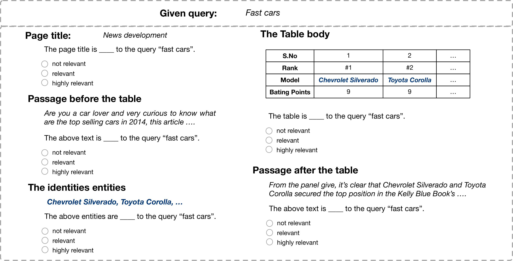

# WTR test collection

Web Table Retrieval (WTR) test collection is a benchmark for table retrieval based on a large-scale Web Table Corpora extracted from the Common Crawl.
We not only provide relevance judgments of query-table pairs, but also the relevance judgments of query-table context pairs with respect to a query.




# Dataset Summary


## Relevance Judgements

The following files are relevance judgments for query-table/context pairs.


|                                                                           Description                                                                           |             Location            |
|:---------------------------------------------------------------------------------------------------------------------------------------------------------------:|:-------------------------------:|
| Relevance Judgment for query-table pairs. It corresponds to <br> the annotations of previous test collections(e.g. [WikiTables](https://github.com/iai-group/www2018-table)).   | ./data/rel_table_qrels.txt      |
| Relevance Judgment for query-page title pairs.                                                                                                                  | ./data/rel_PageTitle_qrels.txt  |
| Relevance Judgment for query-entities pairs.                                                                                                                    | ./data/rel_entity_qrels.txt     |
| Relevance Judgment for query-textAfter pairs.                                                                                                                   | ./data/rel_textAfter_qrels.txt  |
| Relevance Judgment for query-textBefore pairs.                                                                                                                  | ./data/rel_textBefore_qrels.txt |


## Table-Query Dumps


|                                           Description                                          |                                   Location                                  |
|:----------------------------------------------------------------------------------------------:|:---------------------------------------------------------------------------:|
| The same set of 60 queries used in [WikiTables](https://github.com/iai-group/www2018-table).   | ./data/queries.txt                                                          |
| The set of raw table content in the pooled results.                                            | ./data/wdc_pool.json.tar.gz                                                 |
| The full version of processed WTR table dump (with entity linking results).                    | [click to download]<br>(<br>https://zenodo.org/record/3627274#.YD31RS2cbcI) |


## Splits for Cross Validation

We provide the 5-fold data splits under "./data/" and each file is named as "fold_split.jsonl".
Our baselines are trained/tested on those data splits for 5-fold cross validation. 
 In each record of a JSON file, we provide the query, table content and label(the label in ./data/rel_table_qrels.txt).
 
 
## Baselines


The rankings of baselines are under "./rankings/". Except "pool" folder, each of the rest folder is named by a baseline method and includes the corresponding ranking results in that folder.

The STR features are saved in "./data/wdc_STR.csv". The 1st 9 features in the file are LTR features.

# Reproduction

Here we describe how to process the raw original WDC corpus and obtain the pooling results.


## Environment

We use [elasticsearch 5.2](https://www.elastic.co/downloads/past-releases/elasticsearch-5-3-0) to index the corpus.
Please run it when you index and obtain the pooling results.

Besides, we have the following environment

```angular2html
python 3.7
pandas 0.25.3
elasticsearch 5.5.3
nltk 3.4.5
numpy 1.17.4
scipy 1.5.2

```

## Preprocessing and Indexing

To reproduce and index the WTR table dump, there are three steps: 

1. download the wdc dump files from file_list:
```
    wget -i file_list.txt
```
2. match the downloaded wdc dumps with the entity linking results (available [here](https://zenodo.org/record/3627274#.YD31RS2cbcI) ) from "Novel Entity Discovery from Web Tables, WWW 2020":
```
    python extract.py
```
3. create the index (with elasticsearch running as the backend):
```
    python indexer.py
```

Please check the data paths/folder structures in "metadata.py".
For convenience, we provide the processed WTR table dump [here](http://www.cse.lehigh.edu/~brian/data/WTR_tables.tar.gz). You can directly index this file(i.e. step 3).


## Pooled Results

You can obtain the initial top-20 results from unsupervised baselines(BM25 on different fields) by running:
```
    python pool_ranker.py
```
The ranking results in TREC format are saved under "./ranking/pool/". The file name corresponds to the field.
 We also provide the pooled tables in "./data/wdc_pool.json.tar.gz" 
 where you can access the raw table content according to the table id.


### Acknowledgements
The implementation of elasticsearch interface (elastic.py,elastic_cache.py,scorer.py) was adapted from [Nordlys](https://github.com/iai-group/nordlys).